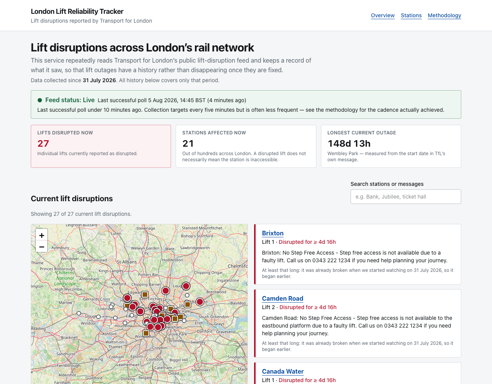
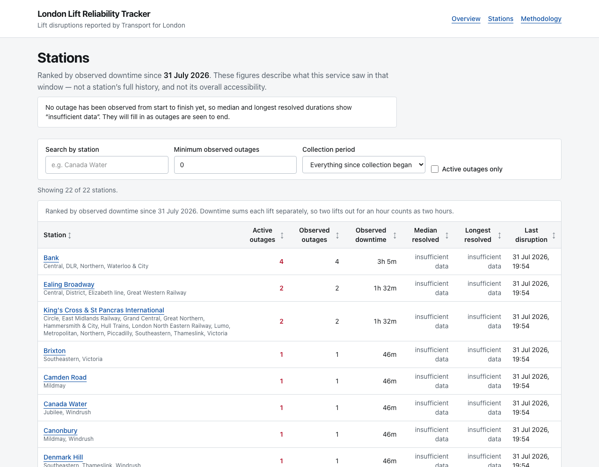
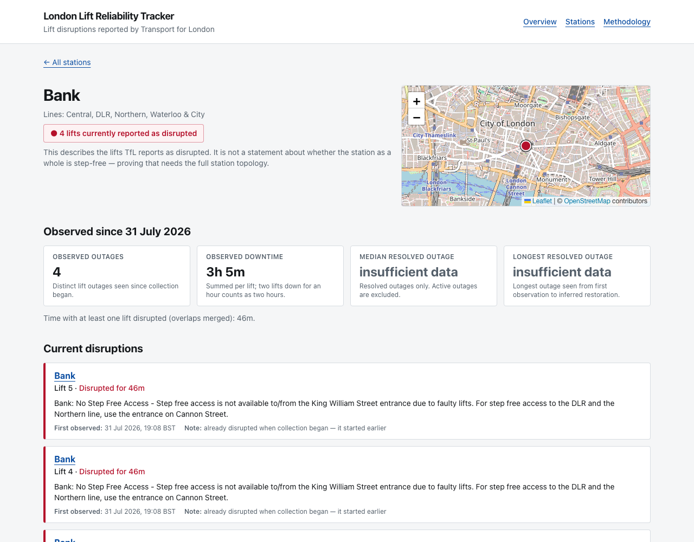
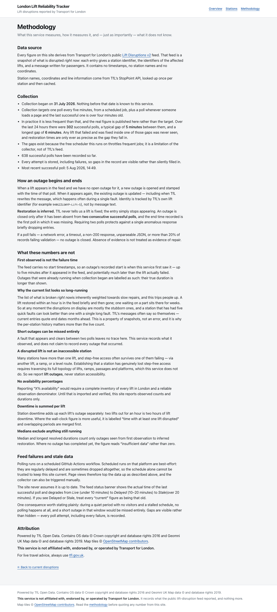
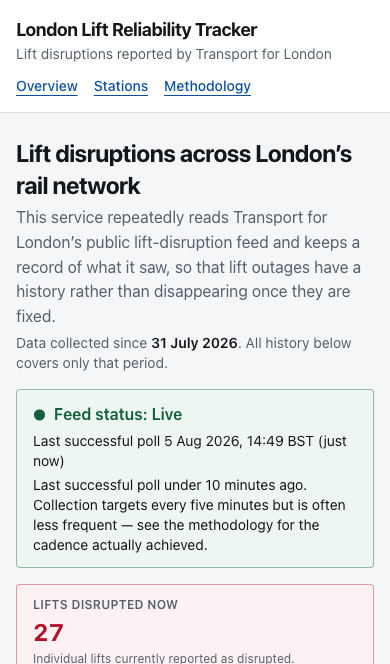

# London Lift Reliability Tracker

Transport for London publishes which station lifts are broken **right now**, but no history: when a
lift is fixed, its entry disappears and the event is gone. So there is no public way to ask "how
often does this lift fail, and for how long?"

This service polls that feed repeatedly and keeps what it saw. From launch onward, lift
outages accumulate a record — visible on a map, in a list, and per station.

**It reports lift outages and observed downtime. It does not claim a station is inaccessible**, and
it never presents inferred data as fact.



---

## What it can and cannot say

The single constraint running through the whole design: history exists only from the moment
collection started, and restoration times are inferred rather than reported.

| Claimed | Not claimed |
| --- | --- |
| Current lift disruptions reported by TfL | Every historical TfL outage |
| Observed outages since a stated date | Official repair durations |
| Observed downtime by station | "This station is inaccessible" |
| Restoration inferred from the feed | Reliability over the past year |
| The cadence collection actually achieved, published on the site | "Collected every five minutes" — the schedule is throttled, so real gaps are longer |

Station availability percentages are deliberately absent: they would need a verified inventory of
every lift and an honest observation denominator.

---

## What the live feed actually contains

Verified against `GET https://api.tfl.gov.uk/Disruptions/Lifts/v2` before any adapter was written
(`npm run inspect:tfl` reproduces this). Each record has exactly three fields:

```json
{
  "stationUniqueId": "940GZZLUWYP",
  "disruptedLiftUniqueIds": ["940GZZLUWYP-Lift-5"],
  "message": "WEMBLEY PARK STATION: From Monday 10 March until Autumn 2026, no lift service…"
}
```

Three consequences shape everything else:

1. **No timestamps.** An outage's start is when *we first saw it* — an upper bound on the real
   failure time. Outages already running at collection start are labelled as such, and their
   durations are lower bounds.
2. **One record can list several lifts.** Bank has listed four at once. Each lift is a separate
   physical asset with its own history, so a record is fanned out into one outage per lift.
3. **No names or coordinates.** Those come from TfL's StopPoint API, looked up once per station and
   cached — so the steady state is zero extra API calls per poll.

The feed covers Underground, Overground, Elizabeth line, DLR and rail interchanges — not just the
Tube.

---

## Architecture

```
GitHub Actions (cron)  +  any page view with stale data
  └─> POST /api/internal/poll-lifts        Authorization: Bearer CRON_SECRET
        └─> lib/tfl/poll.ts  runPoll()
              1. fetch feed + validate           network, 15s timeout, ≤2 retries
              2. normalise, fan out per lift     pure
              3. resolve unknown stations        network, StopPoint, DB-cached
              4. ONE transaction                 advisory lock → upserts → state machine
```

Network calls happen **before** the transaction opens. The spec this was built from puts the fetch
inside it; holding a Postgres transaction across a 15-second network timeout starves the connection
pool and will eventually deadlock a hosted pooler. Every guarantee is preserved: writes are atomic,
only one poll runs at a time, a concurrent caller gets HTTP 409, and a failed fetch is recorded as a
`FAILED` PollRun that closes nothing.

Reads are plain Prisma queries in server components; `/api/*` exposes the same data as JSON.

### The outage state machine

- **Identity** is `assetKey`, from TfL's own lift id (`lift:940gzzluwyp-lift-5`) where available,
  falling back through station id + lift name, station name + lift name, and finally a
  date-insensitive message fingerprint. Message text is never the primary key, because TfL rewords
  updates mid-fault.
- **Seen again** → refresh `lastSeenAt` and the message, reset the missing counter, append an
  observation.
- **Missing from a successful poll** → increment the counter and record the first miss.
- **Closed** only after **two consecutive successful** polls without it, dated to the *first* miss,
  with `closureInferred = true`.
- **Never closed on doubt**: failed request, timeout, non-200, unparseable JSON, or more than 20% of
  records failing validation (status `PARTIAL`) all skip the closure pass entirely. An empty array
  is a valid successful poll and does start the countdown.
- A partial unique index (`one_open_outage_per_asset ON "Outage" ("assetKey") WHERE "closedAt" IS
  NULL`) makes "one open outage per lift" a database guarantee, not just application logic.

### Layout

```
app/            pages and API routes
components/     UI (map, list, table, metric cards, feed health)
lib/tfl/        client, Zod schema, normaliser, station resolver, poll state machine
lib/metrics/    durations, medians, interval merging, station aggregates
lib/utils/      text normalisation, hashing, CSV
prisma/         schema and migrations
scripts/        inspect:tfl, poll:once, import:topology
tests/          unit + integration tests (real PostgreSQL)
```

### Screens

| | |
| --- | --- |
| **Stations** — ranked by observed downtime, sortable, with honest "insufficient data" where nothing has resolved yet<br> | **Station detail** — current status, observed metrics and a chronological timeline<br> |
| **Methodology** — what is measured, what is inferred, and what is not claimed<br> | **Mobile** — list before map, no horizontal scrolling<br> |

---

## Local setup

Requires Node 20+ and PostgreSQL 14+.

```bash
git clone <this repo> && cd london-lift-tracker
npm install

createdb lift_tracker
createdb lift_tracker_test          # tests truncate every table; keep it separate

cp .env.example .env                # then edit DATABASE_URL / TEST_DATABASE_URL
npx prisma migrate deploy

npm run poll:once                   # collect real data (safe to repeat)
npm run dev                         # http://localhost:3000
```

A `TFL_APP_KEY` is optional: the feed answers anonymously at 50 requests/minute and polling needs
about one. Register at <https://api-portal.tfl.gov.uk/> for the 500/minute plan and
the client will use the key automatically.

The site shows nothing until at least one poll has run — by design. There are no seeded or mock
records anywhere in this repository.

### Commands

| Command | Purpose |
| --- | --- |
| `npm run dev` | Development server |
| `npm run build` / `npm start` | Production build and serve |
| `npm run inspect:tfl` | Print the live payload's real shape; save `fixtures/tfl-lift-disruptions.json`. No DB writes |
| `npm run poll:once` | Run one collection cycle locally |
| `npm run import:topology -- --file=/abs/path.zip` | Optional lift-inventory enrichment |
| `npm run lint` / `npm run typecheck` / `npm test` | Verification |

### Optional topology import

TfL's static step-free topology extract adds real lift names and the areas each lift connects:

```bash
npm run import:topology -- --file=/absolute/path/to/topology.zip
```

It prints every CSV and its headers, imports `Lifts.csv`, upserts rather than duplicates, keeps all
source columns in `rawMetadata`, and deletes its temporary directory afterwards. By default it only
enriches stations already known from the feed, so a bulk import cannot flood the rankings with
stations that have never had an observed outage; pass `--create-stations` to import the full
inventory. **The app runs perfectly well without this.**

---

## Testing

```bash
npm test
```

Integration tests run against a **real** PostgreSQL (`TEST_DATABASE_URL`), because the parts most
worth testing — the advisory lock, the partial unique index, transaction rollback — do not exist in
a mock. Migrations are applied automatically; tables are truncated between cases.

The state-machine suite covers the sequences that protect against a false "repaired" claim: an
outage appearing, re-appearing without duplicating, surviving a reworded message, staying open after
one miss, resolving after two, **not** resolving when a request fails between misses, re-opening as a
new outage after a relapse, closing everything after two empty feeds, refusing to close on a partial
poll, and rejecting a second concurrent poll via the advisory lock.

---

## Deployment

Any Postgres and any Node host will do; these steps assume Supabase + Vercel.

1. **Database** — create a Supabase (or Neon/RDS) project and copy its connection string.
2. **Migrate** — with `DATABASE_URL` set to the **direct** (non-pooled) URI:
   ```bash
   npx prisma migrate deploy
   ```
3. **Deploy** the app to Vercel. Set environment variables:
   - `DATABASE_URL` — the **pooled** connection URI
   - `CRON_SECRET` — `openssl rand -hex 32`
   - `NEXT_PUBLIC_APP_URL` — e.g. `https://your-app.vercel.app`
   - `TFL_APP_KEY` — optional
4. **Schedule polling** — add repository secrets `APP_URL` (no trailing slash) and `CRON_SECRET`
   (identical to the app's), then run the **Poll TfL lift disruptions** workflow via
   *workflow_dispatch*.
5. **Verify**, in order:
   - `GET /api/health` reports a `lastSuccessfulPoll`
   - the homepage lists current outages on the map **and** in the list
   - after the next scheduled run, a second observation exists for an ongoing outage
   - an invalid bearer token returns **401**
   - pausing the workflow degrades the banner: Live → Delayed (10 min) → Stale (20 min)

Scheduled GitHub Actions can be delayed or dropped under load, which is precisely why the app
displays feed freshness with a timestamp instead of assuming it is current.

---

## Methodology

The full, public version is at `/methodology`. In short:

- Everything is stored in UTC and displayed in `Europe/London` (with BST/GMT shown explicitly).
- Outage start = first observation. It is an upper bound on the true failure time.
- Outage end = inferred from two consecutive successful polls without it, dated to the first miss.
- **Observed downtime** sums each lift separately: two lifts out for an hour is two lift-hours.
  Where wall-clock time is more useful, it is labelled "time with at least one lift disrupted" and
  overlapping intervals are merged first.
- Medians and longest durations use **resolved** outages only; where none have completed, the UI
  says "insufficient data" rather than `0`.
- Raw payloads are stored for every first and latest sighting, so a future parsing fix can be
  replayed over history already collected.

## Accessibility

This service is about disabled passengers, so accessibility is structural rather than cosmetic:
everything on the map also exists as ordinary HTML; status is conveyed by shape and words as well as
colour; the station table is a real `<table>` with sortable headers and `aria-sort`; filter results
are announced via `aria-live`; focus is always visible; and `prefers-reduced-motion` is respected.

## Attribution

Powered by TfL Open Data. Contains OS data © Crown copyright and database rights 2016 and Geomni UK
Map data © and database rights 2019. Map tiles © OpenStreetMap contributors.

**This project is not affiliated with, endorsed by, or operated by Transport for London.** For live
travel advice, use [tfl.gov.uk](https://tfl.gov.uk/).
